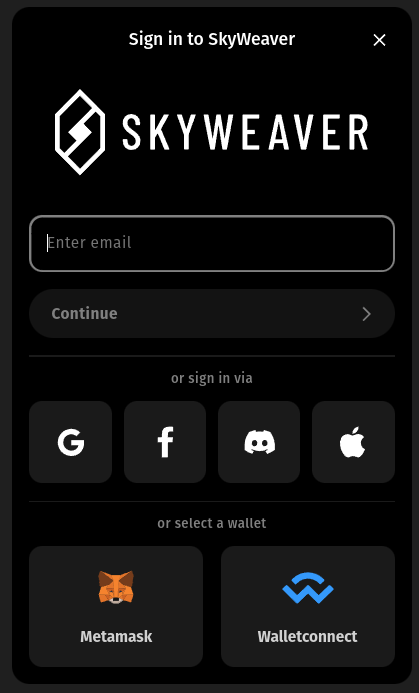

<style>
  .logo-container {
    display: flex;
    justify-content: flex-start;
    align-items: center;
    gap: 10px;
  }

</style>
<div class="logo-container">
  
  
</div>

Sequence Kit 🧰
============

Sequence Kit 🧰 is a library enabling developers to easily integrate web3 wallets in their app. It is based on [wagmi](https://wagmi.sh/) and supports all wagmi features.

- Connect via social logins eg: facebook, google, discord, etc...! 🔐🪪
- Connect to popular web3 wallets eg: walletConnect, metamask ! 🦊 ⛓️
- Full-fledged embedded wallet for coins and collectibles  👛 🖼️ 🪙 
- Fiat onramp 💵 💶 💴 💷

## Quick Start
### Installing the Library
`@0xsequence/kit` is the core package. Any extra modules require this package to be installed first.
To install this package:

```bash
npm install @0xsequence/kit @0xsequence/kit-connectors wagmi ethers viem 0xsequence
# or
npm install @0xsequence/kit @0xsequence/kit-connectors wagmi ethers viem 0xsequence
# or
yarn add @0xsequence/kit @0xsequence/kit-connectors wagmi ethers viem 0xsequence
```


### Setting up the Library
React apps must be wrapped by a Wagmi client and the KitWalletProvider components. It is important that the Wagmi wrapper comes before the Sequence Kit wrapper.


```js
import MyPage from './components/MyPage'
import { KitProvider } from '@0xsequence/kit'
import { getDefaultConnectors } from '@0xsequence/kit-connectors'
import { publicProvider } from 'wagmi/providers/public'
import { mainnet, polygon } from 'wagmi/chains'

function App() {
  const { chains, publicClient, webSocketPublicClient } = configureChains(
    [polygon, mainnet],
    [publicProvider()],
  )

  const connectors = getDefaultConnectors({
    chains,
    walletConnectProjectId: 'project_id',
    defaultChainId: 137
  })

  
  const config = createConfig({
    autoConnect: true,
    publicClient,
    webSocketPublicClient,
    connectors
  })

  return (
    <WagmiConfig client={client}>
      <KitProvider>
        <MyPage />
      </KitProvider>
    </WagmiConfig>
  );
}
```
### Opening the Sign in Modal



Wallet selection is done through a modal which can be called programmatically.

```js
import { useOpenConnectModal } from '@0xsequence/kit'
import { useDisconnect, useAccount, useSigner, useProvider } from 'wagmi'


const MyReactComponent = () => {
  const { setOpenConnectModal } = useOpenConnectModal()

  const { isConnected } = useAccount()

  const onClick = () => {
    setOpenConnectModal(true)
  }

  return (
    <>
      {!isConnected && (
        <button onClick={onClick}>
          Sign in
        </button>
      )}
    </>
  )
}
```


## Packages

| Package  | Description | Docs |
| ------------- | ------------- | ------------- |
| [@0xsequence/kit](./packages/kit)  | Core package for Sequence Kit  | [Read more](./packages/kit/README.md)  |
| [@0xsequence/kit-connectors](./packages/connectors)  | Connectors for sequence kit including popular web3 wallets and social logins  | [Read more](./packages/connectors/README.md)  |
| [@0xsequence/kit-wallet](./packages/wallet)  | Embedded wallets for viewing and sending coins and collectibles   | [Read more](./packages/wallet/README.md)  |
| [@0xsequence/kit-checkout](./packages/checkout)  | Checkout modal with fiat onramp | [Read more](./packages/checkout/README.md)  |
| [@0xsequence/kit-example-react](./examples/react)  | Example application showing sign in, wallet and checkout  | [Read more](./examples/react/README.md)  |


## Local Development


The React example can be used to test the library locally.

1. `pnpm install`
2. From the root folder, run `pnpm watch` to build the package in watch mode in one console. 
3. From the root folder, run `pnpm start:react` to run the react example in another console.


## LICENSE

Apache-2.0

Copyright (c) 2017-present Horizon Blockchain Games Inc. / https://horizon.io
